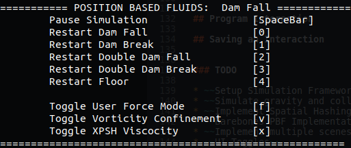

# CSC417 Final Project: Position Based Fluids


## Introduction

[Final project](https://github.com/JacobChmura/PBF)  for *CSC417: Physics based animation*. This repository contains my code for fluid simulation using [Position Based Fluids](https://mmacklin.com/pbf_sig_preprint.pdf)

## Project Layout

The directory and file layout is the following:

```bash
├── CMakeLists.txt
├── data
│   └── debug
│       ├── frames
│       └── gifs
├── include
│   ├── Fluid.h
│   ├── kernel.h
│   ├── SpatialHashGrid.h
│   ├── viscocity.h
│   └── vorticity.h
├── main.cpp
├── README.md
├── results
├── scripts
│   └── create_gif.py
├── setup.h
├── shared
│   ├── include
│   │   └── visualization.h
│   └── src
│       └── visualization.cpp
└── src
    ├── Fluid.cpp
    ├── kernel.cpp
    ├── SpatialHashGrid.cpp
    ├── viscocity.cpp
    └── vorticity.cpp

```


The `main.cpp` file is the entry point of the program. It contains all the constants for the algorithm, launches a simulation thread, and handles callbacks for interactive simulation.

The `setup.h` file involves building the initial fluid state from a selection of simulation scenes.

The `Fluid.cpp` class stores all the physical attributes of the fluid such as particle position, particle velocities, density estimates and constraints. This is where the main algorithm resides.

The `SpatialHashGrid.cpp` class is used for neighborhood search. It stores a hashtable that finds all particle ids within a specified radius of a query point in 3d.

The `kernel.cpp` file defines the smoothing kernels for density estimates and gradient estimation. 

The `Viscocity.cpp` file implements XSPH viscocity.

The `Vorticity.cpp` file implements vorticity confinement.

The `visualization.cpp` file handles all visualizatoin components including displaying the fluid, plotting density in real time, and writing frames to disk for replay.

The `data/` directory stores written frames and gifs created from these frames.

The `results/` directory stores some samples of the method, as well as a writeup of the algorithm.

The `create_gif.py` is a simple python script which takes a directory of frames, builds a gif from these frames, and writes the gif back to the same directory.


## Compilation

Starting in this directory, issue:

```bash
mkdir build
cd build
cmake .. -DCMAKE_BUILD_TYPE=Release
```

Followed by:
```bash
make
```


## Executation

The compilation should create an object file *Position-Based-Fluids*.

To run the program with the default arguments simply issue:

```bash
./Position-Based-Fluids
```

which will launch a fluid with 2000 particles in the Dam Fall scene.


The supported argument list is:

```bash
./Position-Based-Fluids <Simulation Scene> <Number of Particles> <Experiment Name>
```

The `Simulation Scene` is an integer between 0 and 4 inclusive. This determines the initial state of the fluid. Each scene can be pictured below

0: *Dam Fall*            |  1: *Dam Break*            
:-------------------------:|:-------------------------:
  |  

2: *Double Dam Fall*            |  3: *Double Dam Break*            
:-------------------------:|:-------------------------:
  |  


The simulation scene 4 simply involves a stationary fluid as a floor.

The `Number of Particles` is an integer between 10 and 20,000 inclusive. It specifies the number of particles the fluid will have.

The `Experiment id` is a string to name the experiment with. This determines where the frames are exported to if writing frames is enabled (explained below).


For example, to run a *Double Dam Fall* with 10,000 particles issue:

```bash
./Position-Based-Fluids 2 10000
```


## Program Interaction

When the program is launched, you will see this on the command line:




<kbd>Spacebar</kbd> will pause and continue the current simulation

<kbd>0</kbd> will restart a *Dam Fall*

<kbd>1</kbd> will restart a *Dam Break*

<kbd>2</kbd> will restart a *Double Dam Fall*

<kbd>3</kbd> will restart a *Double Dam Break*

<kbd>4</kbd> will restart a *Resting Fluid*

<kbd>f</kbd> will enable or disable *user force mode*. When this is enabled, holding the mouse at a location will create an external force on the fluid in the direction of your mouse. This can be used to create interactive wave like simulations.

<kbd>v</kbd> will enable or disable *vorticity confinement*. By default it is enabled.

<kbd>x</kbd> will enable or disable *XSPH viscocity*. By default it is enabled.

**Note that if you want to change the number of particles in your fluid you need to relaunch the program**


## Saving an Interaction

If you want to record an interaction, perform the following steps. In this example I will simulate a *Resting Fluid* with 10,000 particles, apply my own forces with the mouse, and save the experiment under the name *test_force*

From the same directory as the exuctable, issue the following:

```bash
mkdir ../data/test_force
mkdir ../data/test_force/frames
mkdir ../data/test_froce/gifs
```


Then launch program:

```bash
./Position-Based-Fluids 4 10000 test_force
```

Click on the Window that has launched and press <kbd>f</kbd>. Then apply forces as you wish. When you are done you can simply force shutdown the program from the terminal.


Then, run the pythn script to create a gif from the frames:

```bash
python ../scripts/create_gif.py test_force
```

The result will be found at *data/test_force/gifs/test_force.gif*


### TODO

* ~~Setup Simulation Framework~~
* ~~Simulate gravity and collision detection with bounding box~~
* ~~Implement Spatial Hashing Grid for efficient Neighbourhood Finding~~
* ~~Barebones PBF Implementation (dam break)~~
* ~~Implement multiple scenes~~
* ~~UI Toggles~~
* ~~Apply External Forces with mouse~~
* ~~Viscocity / Vorticity working~~
* ~~Optimize~~
* ~~Better command line args~~
* ~~Density plot~~
* ~~Save frames~~
* ~~Clean up and Document~~
* GPU
* RealTime Rendering

### References

Position Based Fluids: <https://mmacklin.com/pbf_sig_preprint.pdf>